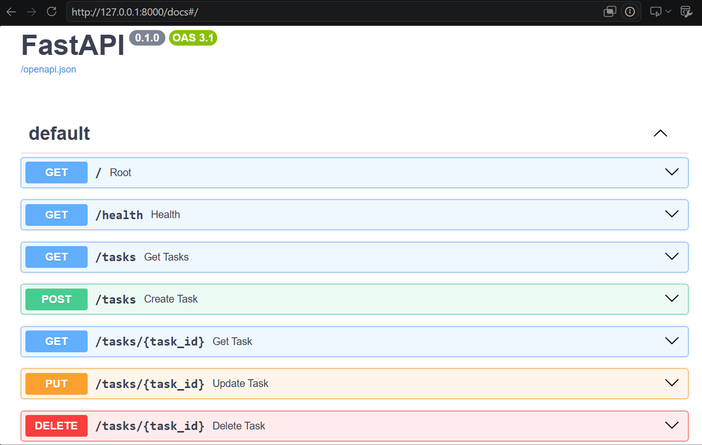

# Task API
## Features
- Create tasks
- Read all tasks
- Read a task by ID
- Update tasks
- Delete tasks
- Interactive API documentation with Swagger UI

---
## Installation
```bash
pip install -r requirements.txt
```

## Run
```bash
uvicorn app:app --reload
```

Server:
```
http://127.0.0.1:8000
```

Swagger UI:
```
http://127.0.0.1:8000/docs
```

---
## Endpoints
| Method | Endpoint | Description |
|--------|----------|-------------|
| GET | `/` | API information |
| GET | `/health` | Health check |
| GET | `/tasks` | Get all tasks |
| GET | `/tasks/{task_id}` | Get one task |
| POST | `/tasks` | Create a task |
| PUT | `/tasks/{task_id}` | Update a task |
| DELETE | `/tasks/{task_id}` | Delete a task |

---
## Example Request
### Create Task

```json
POST /tasks
{
  "title": "Buy milk"
}
```

---
## Swagger UI


